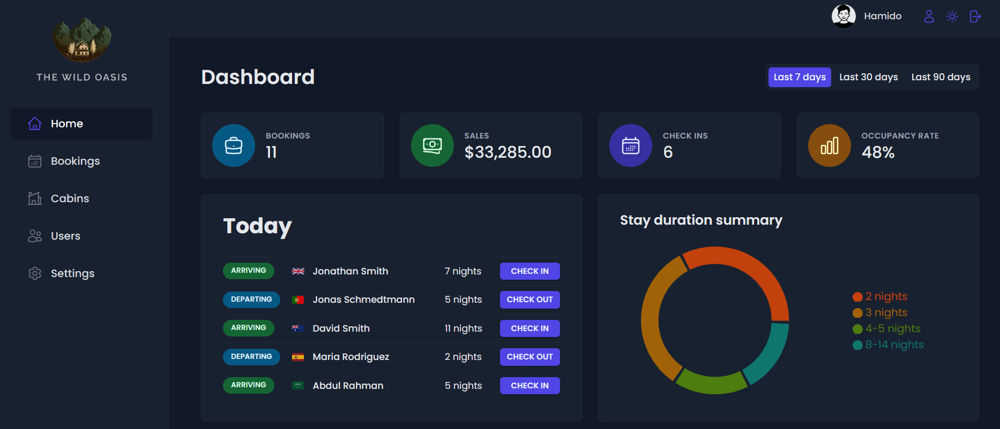
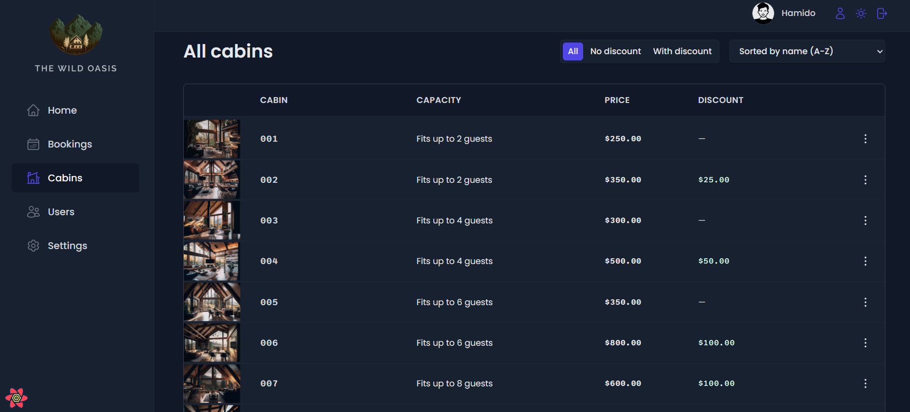
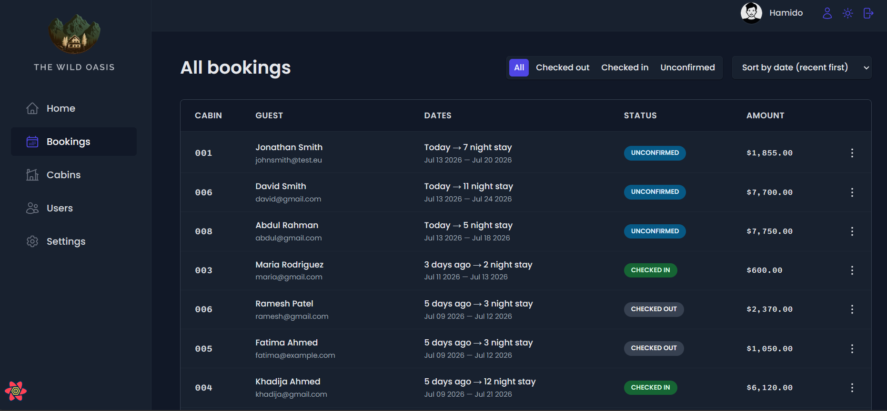

# 🏨 The Wild Oasis

A modern hotel management dashboard built with **React** and **Supabase**, designed to help hotel staff efficiently manage cabins, bookings, guests, and application settings.

This project demonstrates modern React development practices, including server-state management, authentication, reusable UI architecture, data visualization, and CRUD operations.

---

## 🚀 Live Demo

- 🌐 Live Site: https://your-vercel-link.vercel.app
- 📂 GitHub Repository: https://github.com/alhbib699/the-wild-oasis

---

## Screenshots

### Dashboard



### Cabins



### Bookings



---

## ✨ Features

### 🔐 Authentication & Authorization
- Secure user authentication with Supabase Auth.
- Protected application routes.
- User login and logout.
- User registration.
- Update user profile and password.
- Row Level Security (RLS) for database protection.

### 🏡 Cabin Management
- View all cabins.
- Create new cabins.
- Edit cabin information.
- Delete cabins with confirmation modal.
- Duplicate existing cabins.
- Upload cabin images to Supabase Storage.

### 📅 Booking Management
- View all bookings.
- Filter bookings by status.
- Sort bookings.
- Pagination.
- Individual booking details.
- Delete bookings.

### 🛎 Check-in / Check-out
- Check guests in.
- Add optional breakfast during check-in.
- Check guests out.
- Update booking status.

### 📊 Dashboard
- Recent bookings overview.
- Booking statistics.
- Occupancy analysis.
- Daily activity.
- Interactive Line Chart.
- Interactive Pie Chart.

### ⚙️ Application Settings
- View hotel settings.
- Update booking settings.
- Configure breakfast price.
- Configure minimum and maximum booking nights.

### 🎨 User Experience
- Dark Mode.
- Responsive layout.
- Loading indicators.
- Toast notifications.
- Error boundaries.
- Reusable modal system.
- Context menu.
- Reusable table component.

---

# 🛠 Tech Stack

## Frontend

- React 18
- React Router
- React Query (TanStack Query)
- Styled Components
- React Hook Form
- Recharts

## Backend

- Supabase
- Supabase Authentication
- Supabase Database
- Supabase Storage

## State Management

- React Query
- React Context API

## Tooling

- Vite
- Git
- GitHub
- ESLint

---

# 🧠 What I Learned

Throughout this project I gained hands-on experience with:

- Building scalable React applications.
- Server-state management using React Query.
- Authentication and authorization with Supabase.
- CRUD operations with real databases.
- File uploads using Supabase Storage.
- Protected routes and role-based database security.
- Form management with React Hook Form.
- Creating reusable UI components.
- Building compound components.
- Implementing reusable modal windows.
- Applying the Render Props pattern.
- Building reusable Context Menus.
- Client-side and server-side filtering.
- Server-side sorting and pagination.
- Dashboard analytics and data visualization.
- Implementing Dark Mode using CSS Variables.
- Error handling with React Error Boundaries.
- Writing clean, maintainable, and scalable React code.

---

# 📁 Project Structure

```
src
│
├── features
│   ├── authentication
│   ├── bookings
│   ├── cabins
│   ├── check-in-out
│   ├── dashboard
│   └── settings
│
├── pages
├── services
├── hooks
├── ui
├── styles
└── utils
```

---

# ⚡ Getting Started

Clone the repository

```bash
git clone https://github.com/alhbib699/the-wild-oasis.git
```

Navigate into the project

```bash
cd the-wild-oasis
```

Install dependencies

```bash
npm install
```

Create a `.env` file

```env
VITE_SUPABASE_URL=your_supabase_url
VITE_SUPABASE_KEY=your_supabase_anon_key
```

Start the development server

```bash
npm run dev
```

---

# 🌟 Future Improvements

- Add unit and integration testing.
- Add TypeScript support.
- Improve dashboard analytics.
- Export booking reports.
- Add email notifications.
- Add internationalization (i18n).
- Improve accessibility (WCAG).

---

# 👨‍💻 Author

**Muhammed Hamido**

- GitHub: https://github.com/alhbib699
- LinkedIn: https://www.linkedin.com/in/muhammed-hamido/

---

# 📄 License

This project is intended for educational and portfolio purposes.
